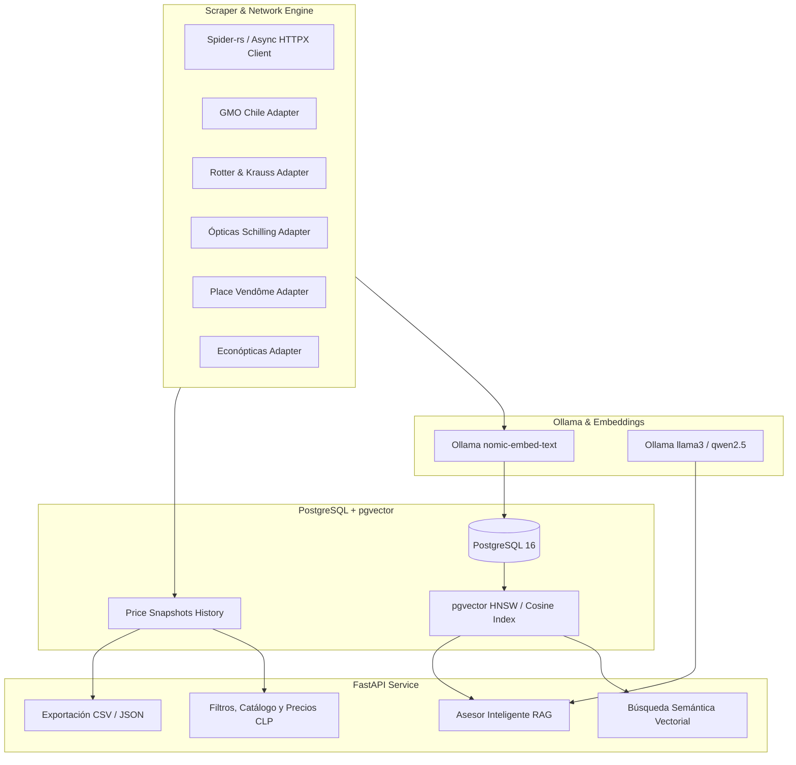

# 👓 Chilean Optics Scraper, pgvector & Ollama AI API

[](https://github.com/MargonDiego/opticas-chile-scraper/actions/workflows/ci.yml)
[](https://www.python.org/)
[](https://github.com/astral-sh/uv)
[](https://github.com/pgvector/pgvector)
[](https://ollama.com)
[](https://opensource.org/licenses/MIT)

A high-performance web scraper, vector search, and AI assistant REST API for tracking, comparing, and semantically querying optical products across major retail chains in Chile.

Powered by **[`uv`](https://github.com/astral-sh/uv)**, **PostgreSQL with `pgvector`**, **[`Ollama`](https://ollama.com)** for local LLM recommendations & embeddings, and **FastAPI**.

---

## 🏬 Cadenas de Ópticas Cubiertas en Chile

| Tienda | Dominio | Plataforma | Categorías Objetivo |
| :--- | :--- | :--- | :--- |
| **GMO Chile** | `gmo.cl` | Luxottica Enterprise / Custom | Lentes de Sol, Ópticos, Contacto |
| **Rotter & Krauss** | `ryk.cl` / `rotterandkrauss.cl` | GrandVision / VTEX / Shopify | Lentes de Sol, Ópticos, Contacto |
| **Ópticas Schilling** | `schilling.cl` | VTEX / Custom | Lentes de Sol, Ópticos, Contacto |
| **Place Vendôme** | `opv.cl` / `placevendome.cl` | VTEX / Custom | Armazones de Diseño, Sol, Cristales |
| **Econópticas** | `econopticas.cl` | VTEX | Lentes Económicos, Sol, Contacto |

---

## 🏗️ Arquitectura del Sistema



---

## 🚀 Inicio Rápido (Desarrollo Local)

### 1. Clonar e Instalar dependencias con `uv`
```bash
git clone https://github.com/MargonDiego/opticas-chile-scraper.git
cd opticas-chile-scraper

# Sincronizar entorno virtual
uv sync
```

### 2. Ejecutar Tests
```bash
uv run pytest -v
```

### 3. Levantar la API localmente
```bash
uv run uvicorn src.main:app --reload --port 8000
```
Documentación Swagger disponible en [http://localhost:8000/docs](http://localhost:8000/docs).

---

## 🌐 Endpoints Principales de la API

| Método | Endpoint | Descripción |
| :--- | :--- | :--- |
| `GET` | `/api/health` | Estado del sistema, PostgreSQL y conexión a Ollama. |
| `GET` | `/api/products` | Filtros por tienda, marca, categoría, rango de precios en CLP y texto. |
| `GET` | `/api/products/{id}` | Ficha técnica con historial completo de variaciones de precio. |
| `POST` | `/api/products/search/semantic` | **Búsqueda Semántica Vectorial** con pgvector + Ollama. |
| `POST` | `/api/advisor/chat` | **Asesor Inteligente RAG** potenciado por Ollama LLM. |
| `POST` | `/api/scrape/trigger` | Disparar scraping en background por tienda o todas. |
| `GET` | `/api/scrape/jobs` | Historial y estado de jobs de scraping. |
| `GET` | `/api/export/csv` / `.json` | Descarga de datasets completos en CSV o JSON. |

---

## 🐳 Despliegue en Homelab con Coolify (`192.168.1.85`)

El proyecto incluye `docker-compose.yml` con **PostgreSQL + pgvector** (`pgvector/pgvector:pg16`) y conexión directa al **Ollama** de tu servidor.

Consultá la guía completa en **[DEPLOY_COOLIFY.md](DEPLOY_COOLIFY.md)**.

---

## 📄 Licencia
Distribuido bajo la Licencia MIT.